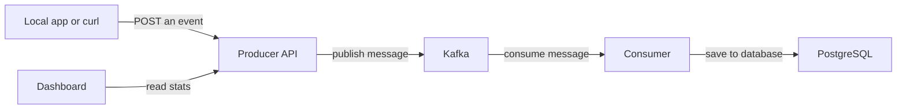

# kafka-notification-pipeline


Inspired by real-world financial services infrastructure, where event-driven pipelines process transactions, trigger notifications, and feed audit systems at scale. A Hono producer API validates requests with Zod and serialises events as Avro to Apache Kafka via Confluent Schema Registry. A TypeScript consumer decodes each message using the embedded schema ID, persists it to PostgreSQL with idempotent inserts, commits offsets manually for at-least-once delivery, and routes any failed messages to a dead letter queue. A React 18 + TypeScript dashboard polls the producer API every 3 seconds to visualise live event throughput, per-type stat cards, a pipeline flow diagram, and a scrollable event log.

---

### For a deeper dive into this project

> **[Technical Reference](docs/TECHNICAL.md)** — Schema Registry flow, consumer flow, Kafka concepts, API endpoints and event schemas

> **[Detailed dev log](https://www.notion.so/dev-log-kafka-notif-pipeline-33fedccf116b80a7a84ffdd0c9b46b72?source=copy_link)** — This project is designed for portfolio purposes, as such you may find my complete dev log to see decision making and debugging as I am developing.

---

## Tech stack

| Layer | Technology | Notes |
|---|---|---|
| Message broker | Apache Kafka 3.9 (KRaft) | No Zookeeper — `apache/kafka:3.9.0` |
| Schema format | Avro + Confluent Schema Registry | Enforces message contracts |
| Kafka UI | Kafbat UI | Monitor topics at `localhost:8080` |
| Producer | TypeScript + Hono | REST API, Zod validation, Avro-encoded events |
| Consumer | TypeScript + kafkajs | Poll loop, manual offset commit, DLQ |
| Database | PostgreSQL 16 | Persists events, idempotent inserts |
| Frontend | React 18 + TypeScript + Vite | Live pipeline visualiser |
| Testing | Vitest + Testing Library | Unit tests across producer, consumer, and dashboard |
| Infra (local) | Docker Compose | Full stack with one command |
| Infra (prod) | AWS ECS Fargate + EC2 + RDS | See [Deployment](#deployment-work-in-progress) |
| CI | GitHub Actions | Lint + tests on push/PR |

---

## Architecture

_What is this system doing at a high level?_



An **event** (e.g. a user registered, a transaction exceeded a threshold) is sent to the **Producer API**. The Producer publishes it to **Kafka**, which acts as a buffer. The **Consumer** picks it up and saves it to the **database**. The **Dashboard** reads stats from the Producer API to display what's happening live.

---

## Build status

- [x] Docker Compose stack — Kafka (KRaft), Kafbat UI, PostgreSQL, Schema Registry, Producer, Consumer, Dashboard
- [x] PostgreSQL schema — `events` table with idempotent insert pattern
- [x] Makefile — `make up`, `make down`, `make logs`, `make db`, `make seed`, `make test`
- [x] Producer service — Hono API + Zod validation + Avro serialisation + Schema Registry registration
- [x] Avro schemas + Confluent Schema Registry — `user-event` and `transaction-event` schemas registered on startup
- [x] `make seed` + Postman — both endpoints verified end-to-end
- [x] Producer — suppress noisy KafkaJS partitioner warning; Schema Registry readiness probe before startup
- [x] Consumer scaffold — Dockerfile, package.json, tsconfig, kafkajs connection + topic subscription wired into Docker Compose
- [x] Consumer service — Avro decoding via Schema Registry, PostgreSQL persistence, manual offset commit, DLQ routing
- [x] React dashboard — live pipeline visualiser, stat cards, throughput chart, event log (polls every 3 s)
- [x] Dashboard migrated to TypeScript — all components typed, shared `types.ts`, strict mode enabled
- [x] Dashboard component tests — 21 tests across StatCards, EventLog, Pipeline, Throughput (Vitest + Testing Library)
- [x] GitHub Actions CI — lint + tests on push/PR (Node 24.x)

---

## Quick start

```bash
make up      # start all services
make seed    # POST sample events to the producer API
make logs    # stream logs from all services
make down    # stop and remove containers
```

| Command | What it does |
|---|---|
| `make up` | Start all services detached |
| `make down` | Stop and remove containers |
| `make rebuild` | Rebuild images and start services |
| `make logs` | Stream logs from all services |
| `make ps` | Show container status |
| `make db` | Open psql in the postgres container |
| `make seed` | POST one `user.registered` and one `transaction.threshold_exceeded` event |
| `make test` | Run vitest across producer, consumer, and dashboard |

---

## Services

| Service | URL |
|---|---|
| Kafbat UI | http://localhost:8080 |
| Schema Registry | http://localhost:8081 |
| Producer API | http://localhost:3001 |
| Dashboard | http://localhost:3000 |
| PostgreSQL | `localhost:5432` |

---

## Environment variables

Copy `env.example` to `.env` (or run `make setup`):

```
POSTGRES_USER=
POSTGRES_PASSWORD=
POSTGRES_DB=
POSTGRES_HOST=
POSTGRES_PORT=
KAFKAJS_NO_PARTITIONER_WARNING= # optional
KAFKA_BOOTSTRAP_SERVERS=localhost:9094
SCHEMA_REGISTRY_URL=http://localhost:8081
```

Never commit `.env` — it is gitignored.

---

## Why Kafka?

At scale in financial services, one event stream fans out to multiple independent consumers simultaneously — fraud detection, push notifications, audit logging, data warehouse — all reading the same Kafka topic without knowing about each other. This project demonstrates that pattern at a smaller scale: a single producer, a single consumer, but with the architectural vocabulary (topics, partitions, consumer groups, offsets, DLQ) that transfers directly to production systems.

---

## Deployment _(work in progress)_

### Architecture overview

| Component | Where |
|---|---|
| Kafka (`apache/kafka:3.9.0`) | Single EC2 t3.micro |
| Schema Registry (`confluentinc/cp-schema-registry`) | Same EC2 (Docker) |
| Producer (Hono) | ECS Fargate |
| Consumer (Node.js) | ECS Fargate |
| Dashboard (nginx) | ECS Fargate |
| PostgreSQL | RDS t3.micro |

### Deployment checklist

#### Infrastructure (Terraform)

- [ ] Security groups: ALB → ECS, ECS → Kafka EC2, ECS → RDS (least-privilege ingress only)
- [ ] EC2 t3.micro for Kafka + Schema Registry (Docker, KRaft mode)
- [ ] RDS PostgreSQL instance (security group restricts access to ECS tasks only)
- [ ] ECR repositories for producer, consumer, and dashboard images
- [ ] ECS cluster (Fargate capacity provider)
- [ ] Task definitions for producer, consumer, and dashboard
- [ ] ECS services wired to the cluster
- [ ] ALB with HTTPS listener and ACM certificate

#### Secrets and IAM

- [ ] Secrets Manager secrets for DB credentials, Kafka bootstrap address, Schema Registry URL
- [ ] IAM task execution role with scoped Secrets Manager + ECR read permissions
- [ ] GitHub OIDC IAM role for CI/CD (no long-lived access keys)

#### Terraform workflow

- [ ] `terraform init`
- [ ] `terraform plan`
- [ ] `terraform apply`

#### CI/CD (GitHub Actions — per deploy)

- [ ] Push to `main` triggers the workflow
- [ ] Lint + Vitest tests pass across producer, consumer, and dashboard
- [ ] Docker images built and pushed to ECR
- [ ] ECS services updated with a rolling deploy

---

*[samanthahill.dev](https://samanthahill.dev) · [LinkedIn](https://www.linkedin.com/in/sammy-hill-173078142/)*
