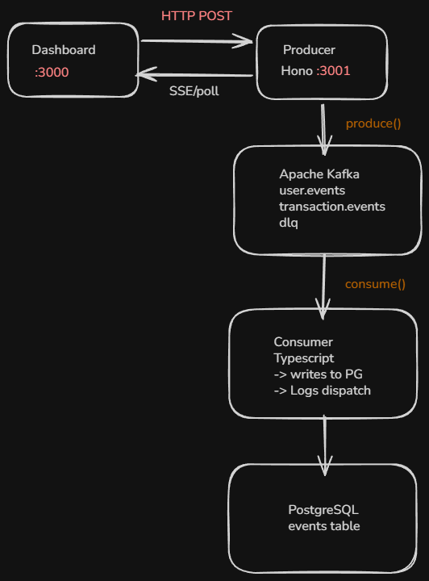

# kafka-notification-pipeline

> **Work in progress** — producer and consumer pipeline complete end-to-end. React dashboard coming next.

Inspired by real-world financial services infrastructure, where event-driven pipelines process transactions, trigger notifications, and feed audit systems at scale. A Hono producer API validates requests with Zod and serialises events as Avro to Apache Kafka via Confluent Schema Registry. A TypeScript consumer decodes each message using the embedded schema ID, persists it to PostgreSQL with idempotent inserts, commits offsets manually for at-least-once delivery, and routes any failed messages to a dead letter queue. A React dashboard will visualise live event throughput as it flows through the pipeline.

---

### For a deeper dive into this project

> **[Technical Reference](docs/TECHNICAL.md)** — Schema Registry flow, consumer flow, Kafka concepts, API endpoints and event schemas

> **[Detailed dev log](https://www.notion.so/dev-log-kafka-notif-pipeline-33fedccf116b80a7a84ffdd0c9b46b72?source=copy_link)** — This project is designed for portfolio purposes, as such you may find my complete dev log to see decision making and debugging as I am developing.

---

## Tech stack

| Layer | Technology | Notes |
|---|---|---|
| Message broker | Apache Kafka 3.9 (KRaft) | No Zookeeper — `apache/kafka:3.9.0` |
| Schema format | Avro + Confluent Schema Registry | Enforces message contracts |
| Kafka UI | Kafbat UI | Monitor topics at `localhost:8080` |
| Producer | TypeScript + Hono | REST API, Zod validation, Avro-encoded events |
| Consumer | TypeScript + kafkajs | Poll loop, manual offset commit, DLQ |
| Database | PostgreSQL 16 | Persists events, idempotent inserts |
| Frontend | React 18 + Vite | Live pipeline visualiser |
| Testing | vitest | Unit + integration tests |
| Infra | Docker Compose | Full stack with one command |
| CI | GitHub Actions | Lint + tests on push/PR |

---

## Architecture



---

## Build status

- [x] Docker Compose stack — Kafka (KRaft), Kafbat UI, PostgreSQL, Schema Registry, Producer, Consumer
- [x] PostgreSQL schema — `events` table with idempotent insert pattern
- [x] Makefile — `make up`, `make down`, `make logs`, `make db`, `make seed`, `make test`
- [x] Producer service — Hono API + Zod validation + Avro serialisation + Schema Registry registration
- [x] Avro schemas + Confluent Schema Registry — `user-event` and `transaction-event` schemas registered on startup
- [x] `make seed` + Postman — both endpoints verified end-to-end
- [x] Producer — suppress noisy KafkaJS partitioner warning; Schema Registry readiness probe before startup
- [x] Consumer scaffold — Dockerfile, package.json, tsconfig, kafkajs connection + topic subscription wired into Docker Compose
- [x] Consumer service — Avro decoding via Schema Registry, PostgreSQL persistence, manual offset commit, DLQ routing
- [ ] React dashboard — live pipeline visualiser + event log
- [ ] GitHub Actions CI

---

## Quick start

```bash
make up      # start all services
make seed    # POST sample events to the producer API
make logs    # stream logs from all services
make down    # stop and remove containers
```

| Command | What it does |
|---|---|
| `make up` | Start all services detached |
| `make down` | Stop and remove containers |
| `make rebuild` | Rebuild images and start services |
| `make logs` | Stream logs from all services |
| `make ps` | Show container status |
| `make db` | Open psql in the postgres container |
| `make seed` | POST one `user.registered` and one `transaction.threshold_exceeded` event |
| `make test` | Run vitest across producer, consumer, and dashboard |

---

## Services

| Service | URL |
|---|---|
| Kafbat UI | http://localhost:8080 |
| Schema Registry | http://localhost:8081 |
| Producer API | http://localhost:3001 |
| Dashboard | http://localhost:3000 *(not yet built)* |
| PostgreSQL | `localhost:5432` |

---

## Environment variables

Copy `env.example` to `.env` (or run `make setup`):

```
POSTGRES_USER=
POSTGRES_PASSWORD=
KAFKA_BOOTSTRAP_SERVERS=localhost:9094
SCHEMA_REGISTRY_URL=http://localhost:8081
KAFKAJS_NO_PARTITIONER_WARNING=   # optional
```

Production deployments also require `KAFKA_API_KEY`, `KAFKA_API_SECRET`, `SCHEMA_REGISTRY_API_KEY`, and `SCHEMA_REGISTRY_API_SECRET`.

Never commit `.env` — it is gitignored.

---

## Why Kafka?

At scale in financial services, one event stream fans out to multiple independent consumers simultaneously — fraud detection, push notifications, audit logging, data warehouse — all reading the same Kafka topic without knowing about each other. This project demonstrates that pattern at a smaller scale: a single producer, a single consumer, but with the architectural vocabulary (topics, partitions, consumer groups, offsets, DLQ) that transfers directly to production systems.

---

*[samanthahill.dev](https://samanthahill.dev) · [LinkedIn](https://www.linkedin.com/in/sammy-hill-173078142/)*
