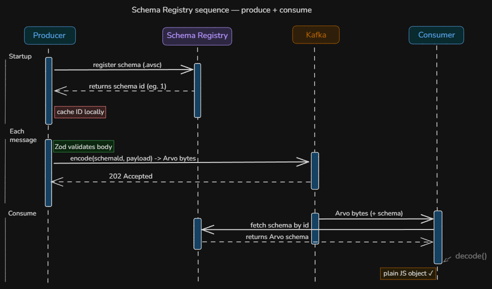

# Technical Reference

## Schema Registry flow

- On startup, the producer registers its Avro schemas with Schema Registry and caches the returned schema IDs
- When an HTTP request arrives, Zod validates the payload at the API boundary before anything touches Kafka
- For each valid event, the producer encodes the payload as Avro bytes with the schema ID embedded, and produces it to the correct Kafka topic
- The consumer receives raw Avro bytes and reads the embedded schema ID from each message
- It fetches the matching Avro schema from Schema Registry using that ID
- `decode()` converts the Avro bytes into a plain JavaScript object ready for processing
- Because the schema ID travels with every message, producer and consumer never share schema files directly — Schema Registry is the single source of truth



---

## Event schemas

All events are Avro-encoded. JSON representation:

**user.events**
```json
{
  "event_id": "uuid4",
  "event_type": "user.registered | user.login | user.password_reset",
  "user_id": "uuid4",
  "timestamp": "ISO8601",
  "metadata": {}
}
```

**transaction.events**
```json
{
  "event_id": "uuid4",
  "event_type": "transaction.completed | transaction.failed | transaction.threshold_exceeded",
  "user_id": "uuid4",
  "amount": 0.00,
  "currency": "AUD",
  "timestamp": "ISO8601",
  "metadata": {}
}
```

---

## Kafka concepts

| Concept | Implementation | Why it matters |
|---|---|---|
| Topics | `user.events`, `transaction.events`, `dlq` | Logical channels per event type |
| Partitions | 3 per topic | Parallelism — multiple consumers |
| Consumer groups | `notification-group` | Horizontal scaling |
| Manual offset commit | `enable.auto.commit: false` | At-least-once delivery guarantee |
| Dead Letter Queue | `dlq` topic | Failed messages aren't lost |
| Message keys | `user_id` | Ordering guaranteed per user |
| Idempotent consumer | `ON CONFLICT DO NOTHING` on `event_id` | Safe on duplicate delivery |

---

## Consumer

Subscribes to `user.events` and `transaction.events` as group `notification-group`.

For each message: decode Avro via Schema Registry → insert to PostgreSQL → commit offset. On any error, the raw bytes are forwarded to `dlq` and the consumer moves on.

**At-least-once delivery** — `autoCommit: false`, offset only commits after a successful DB write. The idempotent insert (`ON CONFLICT (event_id) DO NOTHING`) handles redelivery safely.

**Database insert**
```sql
INSERT INTO events(event_id, event_type, user_id, payload, occurred_at)
VALUES ($1, $2, $3, $4, $5)
ON CONFLICT (event_id) DO NOTHING
```
Transaction fields (`amount`, `currency`, `metadata`) are stored in the JSONB `payload` column. Both event types share this insert path.

---

## API reference

Base URL (local): `http://localhost:3001`

**Request flow**
```
start() → Kafka connects → Avro schemas registered → HTTP server on :3001
POST /events/* → zValidator → build event → produceEvent (Avro encode → Kafka) → 202
GET  /stats          → SELECT event_type, COUNT(*) FROM events GROUP BY event_type
GET  /events/recent  → SELECT * FROM events ORDER BY occurred_at DESC LIMIT 10
```

All endpoints accept and return JSON. Events are Zod-validated at the HTTP boundary and Avro-encoded before being produced to Kafka.

---

### `GET /health`

Returns the service health status.

**Response `200`**
```json
{ "status": "ok" }
```

---

### `POST /events/user`

Publishes a user event to the `user.events` Kafka topic.

**Request body**
```json
{
  "event_type": "user.registered",
  "user_id": "550e8400-e29b-41d4-a716-446655440000",
  "metadata": {}
}
```

| Field | Type | Required | Allowed values |
|---|---|---|---|
| `event_type` | string | yes | `user.registered`, `user.login`, `user.password_reset` |
| `user_id` | string (UUID v4) | yes | — |
| `metadata` | object | no | `Record<string, string>` |

**Response `202`**
```json
{
  "status": "accepted",
  "event_id": "a1b2c3d4-..."
}
```

**Example**
```bash
curl -s -X POST http://localhost:3001/events/user \
  -H 'Content-Type: application/json' \
  -d '{"event_type": "user.registered", "user_id": "550e8400-e29b-41d4-a716-446655440000"}'
```

---

### `POST /events/transactions`

Publishes a transaction event to the `transaction.events` Kafka topic.

**Request body**
```json
{
  "event_type": "transaction.threshold_exceeded",
  "user_id": "550e8400-e29b-41d4-a716-446655440000",
  "amount": 9500.00,
  "currency": "AUD",
  "metadata": {}
}
```

| Field | Type | Required | Allowed values |
|---|---|---|---|
| `event_type` | string | yes | `transaction.completed`, `transaction.failed`, `transaction.threshold_exceeded` |
| `user_id` | string (UUID v4) | yes | — |
| `amount` | number (positive) | yes | — |
| `currency` | string | yes | `AUD` |
| `metadata` | object | no | `Record<string, string>` |

**Response `202`**
```json
{
  "status": "accepted",
  "event_id": "a1b2c3d4-..."
}
```

**Example**
```bash
curl -s -X POST http://localhost:3001/events/transactions \
  -H 'Content-Type: application/json' \
  -d '{"event_type": "transaction.threshold_exceeded", "user_id": "550e8400-e29b-41d4-a716-446655440000", "amount": 9500.00, "currency": "AUD"}'
```

---

### `GET /stats`

Returns event counts grouped by event type. Queries the `events` table directly.

**Response `200`**
```json
[
  { "event_type": "user.registered", "count": "12" },
  { "event_type": "transaction.threshold_exceeded", "count": "5" }
]
```

---

### `GET /events/recent`

Returns the 10 most recent events ordered by `occurred_at` descending.

**Response `200`**
```json
[
  {
    "event_id": "a1b2c3d4-...",
    "event_type": "user.registered",
    "user_id": "550e8400-...",
    "payload": {},
    "occurred_at": "2026-04-16T10:00:00.000Z"
  }
]
```

---

### Testing with Postman

1. Start the stack: `make up`
2. Wait for the producer healthcheck to pass: `make ps`
3. Send requests to `http://localhost:3001`

**Verified requests**

| # | Method | Endpoint | Body |
|---|---|---|---|
| 1 | `GET` | `/health` | — |
| 2 | `POST` | `/events/user` | `{"event_type": "user.registered", "user_id": "550e8400-e29b-41d4-a716-446655440000"}` |
| 3 | `POST` | `/events/user` | `{"event_type": "user.login", "user_id": "550e8400-e29b-41d4-a716-446655440000"}` |
| 4 | `POST` | `/events/transactions` | `{"event_type": "transaction.threshold_exceeded", "user_id": "550e8400-e29b-41d4-a716-446655440000", "amount": 9500.00, "currency": "AUD"}` |
| 5 | `POST` | `/events/transactions` | `{"event_type": "transaction.completed", "user_id": "550e8400-e29b-41d4-a716-446655440000", "amount": 250.00, "currency": "AUD"}` |

After each POST, confirm in Kafbat UI (`http://localhost:8080`) that the message landed in the correct topic with an Avro-encoded payload.

---

## Dashboard

React 18 + TypeScript + Vite app served at `http://localhost:3000`. Polls the producer API every 3 seconds.

**Source structure**
```
dashboard/src/
├── types.ts                  # Shared interfaces: Stat, Event, Toast, ToastType
├── App.tsx                   # Root — fetch loop, toast state, event dispatch
├── main.tsx                  # React DOM entry point
└── components/
    ├── StatCards.tsx         # Four summary counters
    ├── Pipeline.tsx          # Animated flow diagram + send buttons
    ├── Throughput.tsx        # Bar chart (Recharts)
    └── EventLog.tsx          # Scrollable recent-events list
```

**Shared types (`src/types.ts`)**

| Type | Fields |
|---|---|
| `Stat` | `event_type: string`, `count: string` |
| `Event` | `id?`, `event_id?`, `event_type`, `user_id?`, `occurred_at?`, `status?` |
| `Toast` | `id: number`, `msg: string`, `type: ToastType` |
| `ToastType` | `'success' \| 'error'` |

**Components**

| Component | Props | What it shows |
|---|---|---|
| `StatCards` | `stats: Stat[]` | Total produced, consumed, DLQ count, consumer lag |
| `Throughput` | `stats: Stat[]` | Bar chart of event counts per topic (Recharts) |
| `Pipeline` | send callbacks, event handlers | Animated node flow + send buttons for user and transaction events |
| `EventLog` | `events: Event[]` | Scrollable list of the 10 most recent events |

**Data flow**
```
Dashboard (every 3 s) → GET /stats + GET /events/recent → Producer API → PostgreSQL
                       ← JSON response ←
```

The dashboard can also trigger new events directly via the Pipeline component, which POSTs to `/events/user` and `/events/transactions` and immediately re-fetches to reflect the new state.

---

## Testing

Tests run with Vitest + jsdom + Testing Library across all three services.

```bash
make test          # run all tests (producer + consumer + dashboard)
```

Or per-service:
```bash
cd dashboard && npm test
cd producer  && npm test
cd consumer  && npm test
```

**Dashboard test suite**

| File | Tests | What is covered |
|---|---|---|
| `StatCards.test.tsx` | 5 | Zero state, count summation, DLQ filtering, card presence |
| `EventLog.test.tsx` | 7 | Empty state, row count, event types, CSS classes per type and status |
| `Pipeline.test.tsx` | 5 | Node/arrow rendering, send callbacks, error path |
| `Throughput.test.tsx` | 3 | Empty state message, chart container with data |
